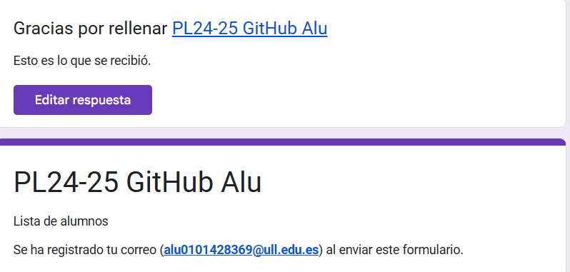
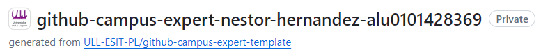
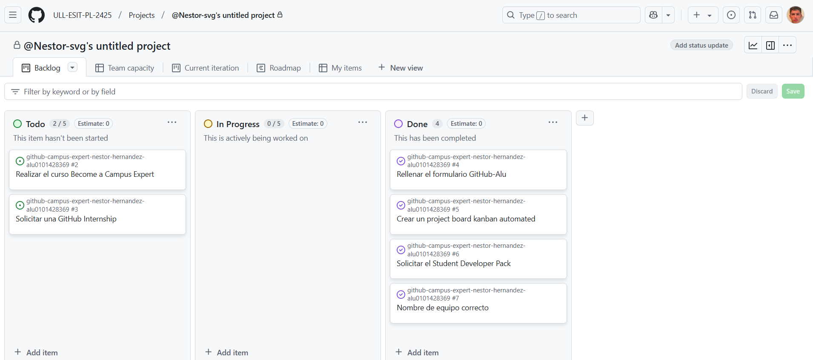
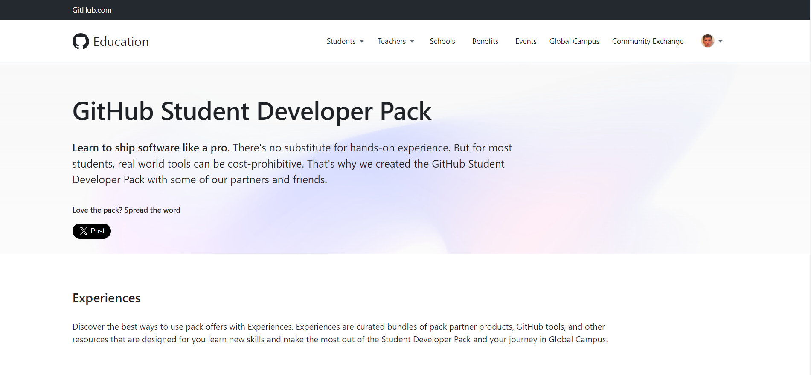

# Github Campus Expert 

- Néstor
- Hernández Rodríguez
- alu0101428369

## Rellenar el cuestionario GitHub-Alu del campus virtual y recibir el correo confirmándolo

## Crear equipo con nombre correcto

## Crear un project board kanban para este repositorio

## Solicitar el GitHub Developer Pack

